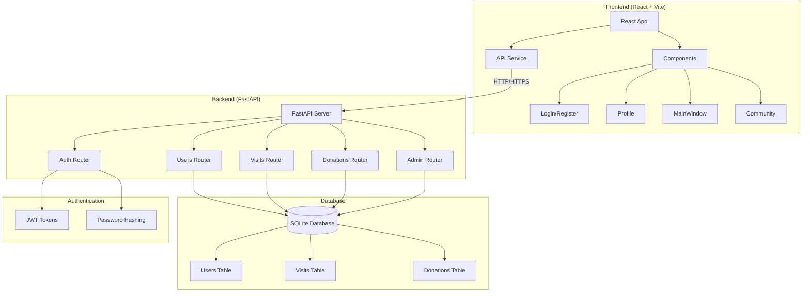

# 🏢 Coworking Platform - Коворкинг Платформа

Современная веб-платформа для управления коворкингом с системой регистрации, аутентификации, отслеживания посещений и пожертвований.

## 🏗️ Архитектура системы



## 🚀 Технологический стек

### Frontend
- **React 19** - современная библиотека для UI
- **Vite 7** - быстрый инструмент сборки
- **Tailwind CSS 4** - utility-first CSS фреймворк
- **ESLint** - линтер для JavaScript/React

### Backend
- **FastAPI** - современный веб-фреймворк для Python
- **SQLAlchemy** - ORM для работы с базой данных
- **SQLite** - база данных (по умолчанию)
- **JWT** - аутентификация с JSON Web Tokens
- **Pydantic** - валидация данных
- **Uvicorn** - ASGI сервер

## 📋 Предварительные требования

- **Python 3.11+**
- **Node.js 18+**
- **npm** или **yarn**

## 🛠️ Установка и запуск

### 1. Клонирование репозитория

```bash
git clone <repository-url>
cd rep-101
```

### 2. Запуск Backend (FastAPI)

```bash
# Переходим в папку backend
cd coworking-backend

# Устанавливаем зависимости
pip install -r requirements.txt

# Запускаем сервер
python start_server.py
```

**Альтернативные способы запуска backend:**

```bash
# Способ 1: Через uvicorn напрямую
uvicorn app.main:app --reload --host 0.0.0.0 --port 8000

# Способ 2: Через Python модуль
python -m uvicorn app.main:app --reload --port 8000
```

Backend будет доступен по адресам:
- **API**: `http://localhost:8000`
- **Документация**: `http://localhost:8000/docs`
- **Health Check**: `http://localhost:8000/health`

### 3. Запуск Frontend (React)

```bash
# Переходим в папку frontend
cd coworking-frontend

# Устанавливаем зависимости
npm install

# Запускаем в режиме разработки
npm run dev
```

Frontend будет доступен по адресу: `http://localhost:5173`

## 🔧 Конфигурация

### Переменные окружения (Backend)

Создайте файл `.env` в папке `coworking-backend`:

```env
SECRET_KEY=your-secret-key-here-change-in-production
ALGORITHM=HS256
ACCESS_TOKEN_EXPIRE_MINUTES=30
DATABASE_URL=sqlite:///./coworking.db
```

### CORS настройки

Backend настроен для работы с любыми доменами в режиме разработки. В продакшене рекомендуется ограничить `allow_origins`.

## 📊 API Endpoints

### Аутентификация
- `POST /auth/register` - регистрация пользователя
- `POST /auth/login` - вход в систему

### Пользователи
- `GET /users/me` - получение профиля текущего пользователя
- `GET /users/{user_id}` - получение профиля пользователя по ID
- `GET /users/{user_id}/visits` - посещения пользователя
- `GET /users/{user_id}/donations` - пожертвования пользователя

### Посещения
- `POST /visits/check-in` - отметка о приходе
- `POST /visits/{visit_id}/check-out` - отметка об уходе

### Пожертвования
- `POST /donations` - создание пожертвования
- `GET /donations/recent` - последние пожертвования
- `GET /donations/stats` - статистика пожертвований

### Администрирование
- `GET /admin/dashboard` - статистика платформы
- `GET /admin/users` - список всех пользователей
- `GET /admin/visits` - все посещения
- `GET /admin/donations` - все пожертвования

## 🗄️ Структура базы данных

### Таблица Users
```sql
CREATE TABLE users (
    id INTEGER PRIMARY KEY,
    email VARCHAR UNIQUE NOT NULL,
    hashed_password VARCHAR NOT NULL,
    full_name VARCHAR NOT NULL,
    is_active BOOLEAN DEFAULT TRUE,
    is_admin BOOLEAN DEFAULT FALSE,
    karma INTEGER DEFAULT 0,
    total_donated FLOAT DEFAULT 0.0,
    created_at DATETIME DEFAULT CURRENT_TIMESTAMP
);
```

### Таблица Visits
```sql
CREATE TABLE visits (
    id INTEGER PRIMARY KEY,
    user_id INTEGER REFERENCES users(id),
    check_in DATETIME DEFAULT CURRENT_TIMESTAMP,
    check_out DATETIME,
    duration_minutes INTEGER DEFAULT 0
);
```

### Таблица Donations
```sql
CREATE TABLE donations (
    id INTEGER PRIMARY KEY,
    user_id INTEGER REFERENCES users(id),
    amount FLOAT NOT NULL,
    donation_date DATETIME DEFAULT CURRENT_TIMESTAMP,
    message VARCHAR,
    is_anonymous BOOLEAN DEFAULT FALSE
);
```

## 🧪 Тестирование

### Тест интеграции

Откройте файл `coworking-frontend/test-integration.html` в браузере для тестирования API endpoints.

### Ручное тестирование API

```bash
# Проверка здоровья сервера
curl http://localhost:8000/health

# Регистрация пользователя
curl -X POST "http://localhost:8000/auth/register" \
     -H "Content-Type: application/json" \
     -d '{"email": "test@example.com", "full_name": "Test User", "password": "testpassword123"}'

# Вход в систему
curl -X POST "http://localhost:8000/auth/login" \
     -H "Content-Type: application/x-www-form-urlencoded" \
     -d "username=test@example.com&password=testpassword123"
```

## 🔄 Workflow разработки

### 1. Разработка Backend
```bash
cd coworking-backend
# Внесите изменения в код
python start_server.py  # Автоматическая перезагрузка при изменениях
```

### 2. Разработка Frontend
```bash
cd coworking-frontend
# Внесите изменения в код
npm run dev  # Автоматическая перезагрузка при изменениях
```

### 3. Тестирование изменений
- Backend: проверьте `http://localhost:8000/docs`
- Frontend: проверьте `http://localhost:5173`
- Интеграция: используйте `test-integration.html`

## 🚀 Деплой в продакшен

### Backend (Docker)
```bash
cd coworking-backend
docker build -t coworking-backend .
docker run -p 8000:8000 coworking-backend
```

### Frontend
```bash
cd coworking-frontend
npm run build
# Разместите содержимое папки dist на веб-сервере
```

## 🔒 Безопасность

- **JWT токены** для аутентификации
- **Хеширование паролей** с bcrypt
- **CORS** настройки для кросс-доменных запросов
- **Валидация данных** с Pydantic
- **SQL injection** защита через SQLAlchemy ORM

## 📝 Логирование

Backend использует стандартное логирование Python. Для продакшена рекомендуется настроить структурированное логирование.

## 🤝 Вклад в проект

1. Форкните репозиторий
2. Создайте ветку для новой функции (`git checkout -b feature/amazing-feature`)
3. Внесите изменения и закоммитьте (`git commit -m 'Add amazing feature'`)
4. Запушьте в ветку (`git push origin feature/amazing-feature`)
5. Создайте Pull Request

## 📄 Лицензия

Этот проект распространяется под лицензией MIT.

## 🆘 Поддержка

При возникновении проблем:

1. Проверьте, что все зависимости установлены
2. Убедитесь, что порты 8000 и 5173 свободны
3. Проверьте логи в консоли браузера и терминале
4. Используйте `test-integration.html` для диагностики API

## 🔮 Планы развития

- [ ] Система бронирования рабочих мест
- [ ] Календарь событий
- [ ] Чат и сообщество
- [ ] Уведомления в реальном времени
- [ ] Мобильное приложение
- [ ] Интеграция с платежными системами
- [ ] Аналитика и отчеты
- [ ] Многоязычность